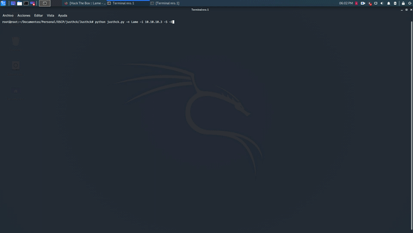

`Justhck` Automate the pentesting process in just a few steps.



**Usage**
---

```
usage: justhck.py [-h] [-n MACHINE_NAME] [-i MACHINE_IP] [-S] [-E] [--version]

Justhck: Hack it Simple

optional arguments:
  -h, --help       show this help message and exit
  -n MACHINE_NAME  The machine name
  -i MACHINE_IP    the machine IP address
  -S               Perform a nmap scan (nmap -p- -sV -oX nmap_report.xml
                   <machine.ip>) and saves the result
  -E               Perform an exploit search for every service running on the
                   machine and save a result
  --version        show program's version number and exit

```

**Installation Options**
---

1. Download with `$ git clone https://github.com/initzerCreations/Justhck`

2. Install dependencies using `pip install -r requirements.txt`

3. Congrats! by now you should be able to run it.


**Features**
---

1. Scan the target machine services

    + Use the flag [-S] to activate it
        - This will save a report of the nmap scan over the services of the target machine.

2. Automatically search for availiable exploits

    + Enable this by using the flag [-E]
        - This will search for exploits for the running services and store them in a report.
    + Availiable explois will be listed so you can decide which one you want to use
    
3. Starts the module of the exploit you want to use in Metasploit

    + Under construction :)

4. The scans made are saved so if an exploit fails you can just rerun the program and try again


**How to Contribute**
---

1. Clone repo and create a new branch: `$ git checkout https://github.com/initzerCreations/Justhck -b name_for_new_branch`.
2. Make changes and test.
3. Submit Pull Request with comprehensive description of changes.

**Donations**
---

This is free, open-source software. If you'd like to support the development of future projects, or say thanks for this one, you can donate BTC at `15gpybVwr8DDywwnHjLDBeP99PKgkoVnx8`.

